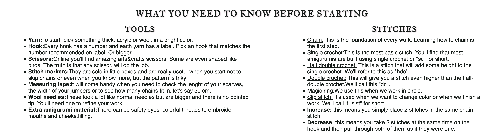
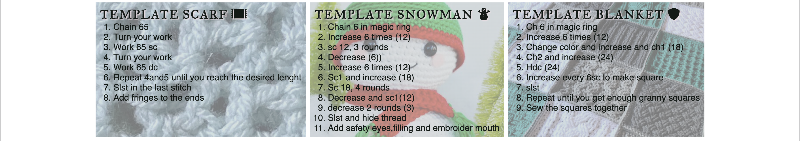
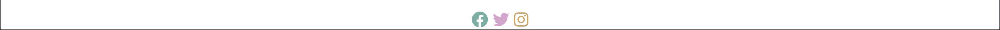
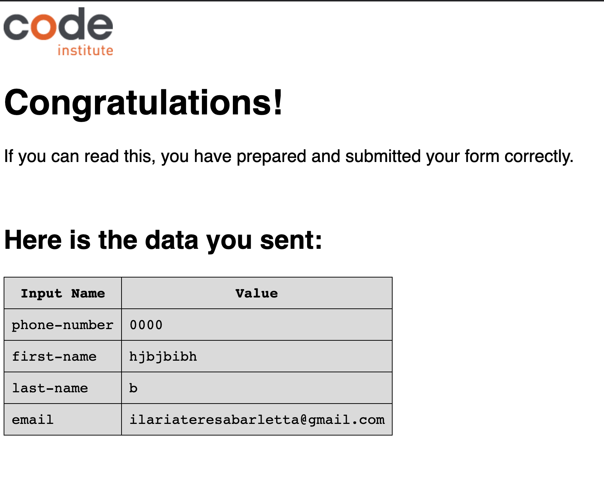
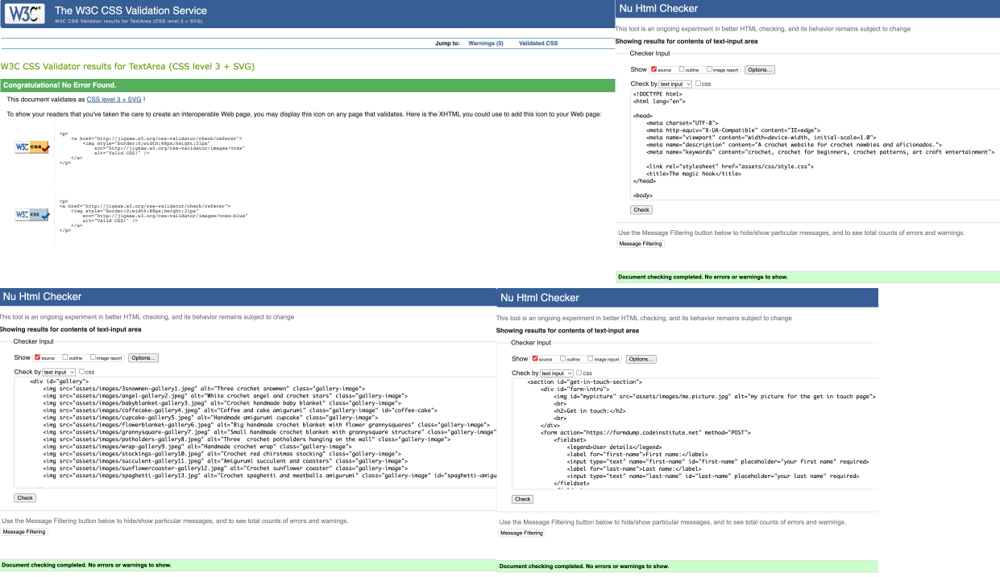
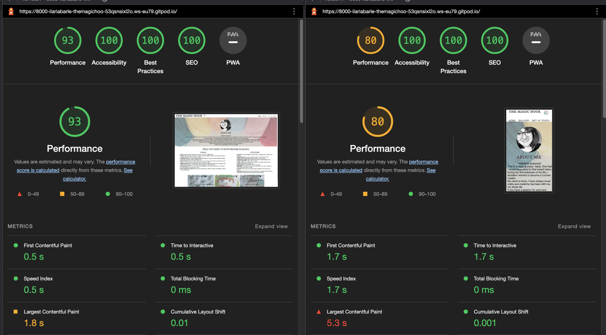

# The Magic Hook

This website is for crochet aficionados and people interested in learning the basics of crochet. It has everything one can possibly need to know before starting to crochet. It provides basic information regarding the first stitches to learn and useful links to youtube videos showing how the stitches are made. It's a guide anyone interested can use in order to quickly understand how to pick up a yarn and an hook and how to create something. 

The live link can be found here: https://ilaria-barletta.github.io/the-magic-hook/

----
## Features

__Navigation Bar__: This section is present in all the pages and the style is consistent. It contains the name of the website, the logo (the logo image has been taken from google images), and a navigation bar to the home page, gallery and get in touch page. It is reponsive and the page in which the user is gets also highlighted for them to better locate themselves.

__About me section__: The about me section has a background that lets the user better understand what the website is all about and a small picture of myself (the backgroung image has been taken from google images and rotated by myself for aesthetic reasons). This section explains the intention of the website and it is my personal welcome to anyone who looks for it or simply finds it. 

__Basics section__: This section consists mainly of two lists one for "tools" and one for "stitches". It is a brief but effective guide to start crochet and understand what's needed and how to work the stitches. In the stitches list, some are underlined. They are links and if clicked will take the user to youtube videos that are tutorials. They come from 2 channels in particular: "FiberFlux" and "Crochet Guru".

__Templates section__: This section is composed of 3 short but nice templates that will help the user in their first projects. All of them have backgrounds that I have made a bit transparent playing with opacity in css. The background images for the snowman template and the blanket template come from google images. 

__Footer__: This section,like the navigation bar, is also present in all the pages and the style is as well consistent. I have styled the icons taken from Font Awesome using colors close to the logo colors in the header section for aesthetic reasons. If clicked the icons will take the user to the facebook, twitter and instagram websites and they will all open in a new tab. 

__Gallery page__: The gallery is composed of a series of images of crochet projects that I have arranged in a grid and that is responsive on different devices. The images come all from one of my personals instagram accounts. 

__Get in touch page__: This page consists of a form that lets the user contact me. The user details and contact information fields present a placeholder text to guide the user in filling the form. The reason to contact me section instead has a checkboxes structure to let the user indicate the reason why they are contacting. 

----
## Testing
__Manual testing__: I have tested the website manually to make sure it works as expected on multiple screens. The media queries are working as intended as, when resizing the page to different sizes, the elements behave correctly. I have also tested that all links open in a new tab and the form works as intended as well. The form will not let the user submit unless they fill all the required fields. 

__Validators__: The website has been tested using [css](https://jigsaw.w3.org/css-validator/) and [html](https://validator.w3.org/#validate_by_input) validators. All tests have returned no errors. The website has been also tested using lighthouse. Both desktop and mobile testing have returned accessibility of 100%.

__Fixed Bugs__: While developing the website I have encountered some issues that have arised when I tested on different screen sizes. 

1. The basics section in the homepage was originally written using the float property. While resizing, the content would overlap and go to the wrong position making it really hard for the user to read. To solve this, the section is now re-written using a flex layout. 
2. The templates section originally had a fixed height that made the text go outside the containers when re-sizing. Removing the fixed height and adding padding to give the space around the content has solved the issue.
3. When writing the gallery, originally there were more columns that I had to reduce in order to make the images display nicely on all screens. 
4. The background images gave me some issues as they were not the right size to fit the containers (in some cases they were repeating and in some others they were too zoomed in). I had the issue on the homepage in the about me section as well as in the templates section. I also had the same issue when adding a background image to the form. By reasearching online I have found some css properties that let me decide how to display the image. I.e. background-position, background-repeat and background-size. 
----
## Deployment
The site has been deployed to GitHub pages. The steps to deploy are as follows:
1. Click on the Settings tab in the repository.
2. Click Pages under the code and automation section.
3. Select "main" as the branch and click Save.
4. Refresh the page and wait for the link to appear.

The live link can be found here: https://ilaria-barletta.github.io/the-magic-hook/

----
## Credits 
1. The logo image has been taken from google images.
2. The background image for the about me section and form comes from google images.
3. The video links in the stitches section come from youtube. In particular they come from 2 channels: "FiberFlux" and "Crochet Guru".
4. The templates images were taked from google images.
5. The icons in the footer were taken from [Font Awesome](https://fontawesome.com/).
6. The images in the gallery page come from one of my instagram accounts: "Littletreasure365".
7. The code to make the social network links was taken from the CI Love running project.