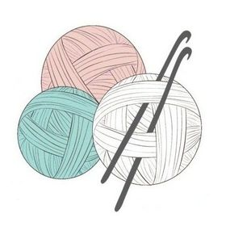

# The Magic Hook

This website is for crochet aficionados and people interested in learning the basics of crochet. It has everything one can possibly need to know before starting to crochet. It provides basic information regarding the first stitches to learn and useful links to youtube videos showing how the stitches are made. It's a guide anyone interested can use in order to quicky understand how to pick a yarn and an hook and how to create something. 
/*Add link here to deployed website*/

----
## Features

__Navigation Bar__ It contains the name of the website, the logo and a navigation bar to the home page, gallery and get in touch page. Everything is reponsive and the page in which the user is gets also highlighted for them to better locate themselves. This navigation bar is present in all the 3 pages and the style is consistent. 

__About me section__

__Basics section__

__Templates section__

__Footer__